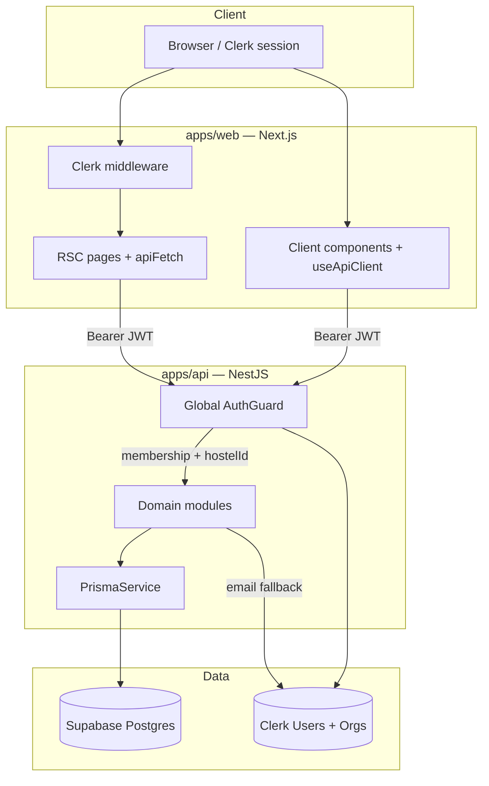
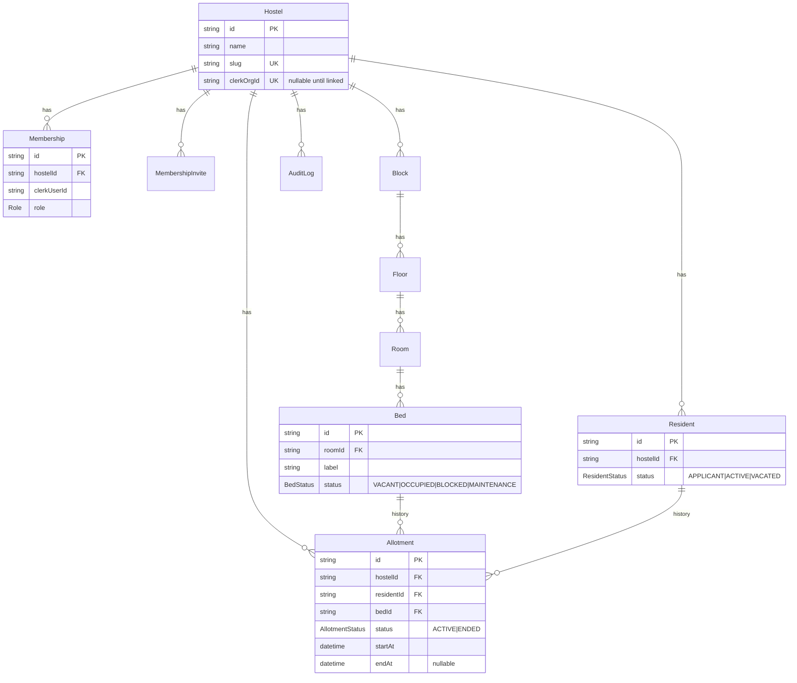

# Vaikuntham — Source of Truth

**Status:** Living document · last updated 2026-08-09  
**Audience:** Humans and agents shipping hostel ops  
**Supersedes when conflicting:** informal chat plans; Linear issue text still wins for *acceptance of a single story*, this doc wins for *system design*

Related:

| Doc | Role |
| --- | --- |
| [ADR-0001](./ADR-0001-stack.md) | Postgres (Supabase) + Prisma + Clerk lock |
| [ADR-0002](./ADR-0002-service-split.md) | NestJS API + Next.js web split |
| [CONTRIBUTING.md](../CONTRIBUTING.md) | Day-to-day workflow |
| Linear epic [CB-150](https://linear.app/cobble-ai/issue/CB-150) | Tenancy/auth integrity (Done) |
| Linear project [Vaikuntham](https://linear.app/cobble-ai/project/vaikuntham-ea7ffff93a0c) | Milestones & stories |

---

## 1. Product intent

Vaikuntham is a **hostel management system** for Indian PG / student hostels.

**Demo-ready bar (target 2026-09-14):** An admin can configure a hostel, manage structure, allot beds, raise invoices, record payments, and show occupancy / collections with seeded data.

**Out of demo scope:** Attendance/gate, mess, WhatsApp, parent portal, multi-hostel SaaS billing, Razorpay live webhooks, GraphQL.

### Roles (staff)

| Role | Typical use |
| --- | --- |
| `ADMIN` | Owner / full hostel ops + settings + audit + invites |
| `WARDEN` | Structure, residents, allotment |
| `ACCOUNTANT` | Fees, payments, reports; read-only structure/occupancy (`viewStructure`) |

Permissions live in `packages/shared/src/permissions.ts` — API and nav both consume the same matrix.

**Multi-hostel limitation (demo):** Session resolves to a single membership (first match / org-linked hostel). An org switcher for staff in multiple hostels is deferred post-demo.

### Staff join model (invite-first)

Vaikuntham uses **one dashboard app** with permission-gated nav — not separate hidden admin URLs. Security is enforced on the API (`@RequirePermissions`, `session.hostelId`).

| Actor | How they join | App surface |
| --- | --- | --- |
| Owner / admin | First Clerk org member for a linked hostel → `ADMIN` | Dashboard; Admin nav group (Settings, Audit) |
| Staff | Admin invites email + role → user joins Clerk org → invite accepted on sign-in | Same dashboard; ops nav per role |
| Occupant (resident) | Staff creates `Resident` + allotment — **not** a Membership | Resident portal post-demo ([CB-121](https://linear.app/cobble-ai/issue/CB-121)) |

**Phase 1 (demo):** invite-only. No self-serve “request access” queue.

**Phase 2 (optional later):** hostel-code access requests with admin approve/reject — not in current scope.

**Membership lifecycle:** admins change roles and revoke staff via `PATCH/DELETE /v1/memberships/:id` (cannot revoke self or last admin).

### HR / salary (out of demo scope)

Staff compensation (salary, pay cycles) is **not** part of hostel ops demo. Defer to a post-W3 module: optional `StaffProfile`, integer paise, `manageHostel` only, audit on every change. Do not couple HR to resident billing or access requests.

---

## 2. Stack locks (do not reopen casually)

```
apps/web     Next.js 15 App Router — UI only, Clerk, no Prisma
apps/api     NestJS 11 — REST /v1, domain mutations, authz
packages/db  Prisma 6 + PostgreSQL (Supabase host; Auth/RLS unused)
packages/shared  Zod DTOs, Role/Permission, API_ROUTES
```

| Concern | Decision |
| --- | --- |
| Mutations | NestJS REST only — **never** domain Server Actions |
| Money | Integer **paise** only — no `float` / JS `number` for amounts |
| Tenancy | Every domain write scoped by `session.hostelId` |
| Auth | Clerk JWT via `@clerk/backend`; org → `Hostel.clerkOrgId` |
| Local UI without Clerk | Both bypass flags true, non-production; API also requires `x-auth-dev-bypass` or localhost peer |
| Migrations | `prisma migrate` only — **never `db push`** (partial indexes) |
| DB connectivity | Session pooler `:5432` for day-to-day; local Docker Postgres for snappy UX |

---

## 3. High-level architecture



### Request path (happy)

1. User signs in with Clerk (org selected or single-org).
2. Web attaches Clerk session JWT to `Authorization: Bearer …`.
3. `AuthGuard` verifies JWT → resolves email (JWT or `users.getUser`) → loads `Membership` by `(clerkUserId, hostel via clerkOrgId)` or invite/bootstrap path.
4. Handler receives `SessionContext { userId, hostelId, role, email }`.
5. Service queries/mutations **always** filter by `hostelId` (or join path that implies it).
6. Sensitive writes emit `AuditLog` (prefer **inside** the same `$transaction`).

### Auth failure surfaces (web)

| Code / status | Destination |
| --- | --- |
| `401` / `UNAUTHENTICATED` | `/sign-in` |
| `403` / `NOT_PROVISIONED` | `/awaiting-access` |
| `403` / `FORBIDDEN` | `/no-permission` |

Client mutations use the same map via `useAuthFailureHandler`.

---

## 4. Entity model (current + planned)

### 4.1 ERD — foundation (shipped)



**Structural tenancy note:** `Block` carries `hostelId`. `Floor` / `Room` / `Bed` inherit hostel via join (`bed → room → floor → block`). Allotment and Resident carry `hostelId` denormalized for fast filters and integrity checks.

### 4.2 Planned entities (fees — W3; do not create early)

| Entity | Purpose | Money fields |
| --- | --- | --- |
| `FeePlan` | Named plan per hostel (monthly rent, deposit, …) | amounts in **paise** |
| `Invoice` | Period bill for a resident | `amountPaise`, `balancePaise` |
| `Payment` | Recorded receipt against invoice(s) | `amountPaise` |
| `InvoiceLine` (optional) | Breakdown | `amountPaise` |

**Invariant:** Never store rupees as float. Display layer formats paise → ₹.

### 4.3 Status machines

**BedStatus**

| Status | Who sets | Meaning |
| --- | --- | --- |
| `VACANT` | System (end allotment) or admin (manual) | Assignable |
| `OCCUPIED` | **Only** allotment assign txn | Has active allotment |
| `BLOCKED` | Admin/warden via status API | Soft-retire; not assignable |
| `MAINTENANCE` | Admin/warden | Not assignable |

`setBedStatusSchema` **excludes** `OCCUPIED` — occupancy is allotment-driven.

**ResidentStatus:** `APPLICANT` → `ACTIVE` (on first assign) → `VACATED` (on vacate flow — CB-130).

**AllotmentStatus:** `ACTIVE` → `ENDED` (end / transfer / vacate). History rows are never deleted.

---

## 5. Domain invariants

These are non-negotiable. Enforce in **service transaction + DB**.

| ID | Invariant | Enforcement |
| --- | --- | --- |
| I1 | One **ACTIVE** allotment per bed | Partial unique index `Allotment_active_bed_key` |
| I2 | One **ACTIVE** allotment per resident | Partial unique index `Allotment_active_resident_key` |
| I3 | `resident.hostelId === bed.hostelId === allotment.hostelId` | `assertAllotmentTenancy` in txn (app-level; no cross-table CHECK in v1) |
| I4 | Assign only if bed `VACANT` and no active allotment | Service checks + I1 |
| I5 | Assign/end updates `Bed.status` in **same** `$transaction` | `AllotmentService` |
| I6 | Hard-delete bed only if never allotted and not occupied | Structure service + `ON DELETE RESTRICT` on allotment→bed |
| I7 | Every staff user has ≤1 membership per hostel | `@@unique([hostelId, clerkUserId])` |
| I8 | At most one open invite per email per hostel | `@@unique([hostelId, email])` |
| I9 | First org member → single ADMIN bootstrap | `SELECT … FOR UPDATE` on hostel + membership count in txn |
| I10 | Invite accept is atomic | Conditional `updateMany` + membership create in one txn |
| I11 | Money in paise | Schema + Zod when fees land |
| I12 | No PII emails in audit metadata | Actor id only; email resolution is ephemeral |

---

## 6. Concurrency & locking design

### 6.1 Principles

1. Prefer **short** Postgres transactions.
2. Prefer **unique constraints / partial indexes** as the final race referee.
3. Use `SELECT … FOR UPDATE` only on the **smallest** row that serializes the race (e.g. `Hostel` for first-admin bootstrap).
4. Retry once on unique-violation for allotment double-book; map to `409 Conflict`.

### 6.2 Critical sections

#### A. First admin bootstrap (CB-154)

```
BEGIN
  SELECT Hostel WHERE id = :id FOR UPDATE
  IF membership_count > 0 → NOT_PROVISIONED / invite path
  ELSE create Membership ADMIN + audit
COMMIT
```

Race: two concurrent first sign-ins → second waits on row lock → sees count ≥ 1 → fails cleanly.

#### B. Invite accept (CB-154)

```
BEGIN
  UPDATE MembershipInvite
    SET acceptedAt = now()
    WHERE id = :id AND acceptedAt IS NULL AND expiresAt > now()
  -- rowCount must be 1
  INSERT Membership …
  INSERT AuditLog …
COMMIT
```

Race: double-accept → one `updateMany` gets 0 rows → conflict.

#### C. Assign allotment (CB-155 service; REST in CB-131)

```
BEGIN
  Load resident WHERE id AND hostelId = session.hostelId
  Load bed WHERE id AND block.hostelId = session.hostelId (FOR UPDATE optional on bed)
  assertAllotmentTenancy(...)
  Assert bed VACANT + no ACTIVE allotments
  INSERT Allotment ACTIVE
  UPDATE Bed SET status = OCCUPIED
  UPDATE Resident SET status = ACTIVE (if needed)
  INSERT AuditLog
COMMIT
-- On P2002 unique → 409 BED_ALREADY_ALLOTTED / RESIDENT_ALREADY_ALLOTTED
```

**Bed row lock (recommended for CB-131):** `SELECT … FROM "Bed" WHERE id = $1 FOR UPDATE` after hostel-scope find, before insert — reduces noisy unique races under concurrent wardens.

#### D. End / vacate

Same txn: set allotment `ENDED` + `endAt`, set bed `VACANT`, audit. Transfer (CB-130) = end + assign in **one** txn (or serializable pair with bed locks on both beds).

#### E. Bulk structure delete

Single txn over all ids; any invalid bed aborts entire batch (atomic).

### 6.3 What we deliberately do **not** do in v1

| Approach | Why deferred |
| --- | --- |
| DB `CHECK` that bed.status matches active allotment | Hard to express with joins; app sync + tests suffice for demo |
| `SERIALIZABLE` isolation globally | Overkill; row locks + partial uniques enough |
| Advisory locks | Prefer row `FOR UPDATE` |
| Soft-delete allotments | Status `ENDED` is the soft close; keep history |

---

## 7. Edge cases catalogue

### Auth / tenancy

| Case | Expected |
| --- | --- |
| JWT missing email | Resolve via Clerk `users.getUser` (60s cache) |
| User in Clerk org with no linked hostel | `NOT_PROVISIONED` → `/awaiting-access` |
| User has invite matching email | Accept invite atomically → membership |
| Second user, no invite | Stay `NOT_PROVISIONED` |
| Warden hits `/v1/audit` | `403 FORBIDDEN` |
| Admin of hostel A patches bed of hostel B | `404` (not found in scope) — never leak existence across tenants when avoidable |
| `AUTH_DEV_BYPASS` in production | Hard-disabled (`NODE_ENV === production`) |
| Bypass env on shared non-prod host | Ignored unless `x-auth-dev-bypass: true` or peer is localhost |
| Bootstrap token wrong/missing | `401` on hostel create/link |
| Accountant GETs structure board | `200` (`viewStructure`); POST/PATCH structure → `403` |
| Warden dashboard stats | Beds + occupancy only; audit/member counts omitted |

### Structure

| Case | Expected |
| --- | --- |
| Delete bed with active allotment | `409 BED_OCCUPIED` |
| Delete bed with ended history | `409 ALLOTMENT_HISTORY` — use `BLOCKED` |
| Rename to duplicate label in room | `409` unique |
| Set status to `OCCUPIED` via API | Zod reject |
| Bulk delete one bad id | Whole batch rolls back |

### Allotment

| Case | Expected |
| --- | --- |
| Assign blocked/maintenance bed | `409 BED_NOT_VACANT` |
| Assign already occupied | `409` |
| Assign resident with active allotment | `409 RESIDENT_ALREADY_ALLOTTED` |
| Cross-hostel resident id | `404` (scoped find) |
| Concurrent double assign same bed | One wins; other unique → `409` |
| End already ended | `404` |
| Transfer to bed in other hostel | Reject via tenancy assert |

### Fees (future)

| Case | Expected |
| --- | --- |
| Partial payment | New `Payment` row; invoice balance decreases; never mutate amount |
| Overpay | Reject or credit note entity — decide in W3 story, default **reject** |
| Void invoice | Status flag; keep rows immutable for audit |

---

## 8. API surface (canonical)

Prefix: `/v1`. Routes constant: `packages/shared/src/api-routes.ts`.

| Area | Methods (summary) | Permission |
| --- | --- | --- |
| Health | `GET /health` | Public |
| Session | `GET /v1/session` | Member |
| Dashboard | `GET /v1/dashboard/stats` | Member |
| Structure | CRUD blocks/floors/rooms/beds, board, status, rename, delete | `manageStructure` |
| Hostels | `POST /v1/hostels`, `PATCH …/link-org` | Bootstrap token |
| Memberships | `GET /v1/memberships`, `PATCH/DELETE …/:id`, invites CRUD | `manageHostel` |
| Settings | `GET /v1/settings` | `manageHostel` |
| Audit | `GET /v1/audit` | `viewAudit` |
| Allotment | `GET/POST /v1/allotments`, transfer/vacate/end | `manageAllotment` |
| Residents | `GET/POST /v1/residents`, `GET/PATCH …/:id`, history | `manageResidents` |
| Occupancy | `GET /v1/structure/occupancy` | `manageStructure` |
| Invites | `GET/POST /v1/memberships/invites`, `DELETE …/:id` | `manageHostel` |
| Fees | *(W3)* | `manageFeePlans` / `managePayments` |

---

## 9. Module map (API)

| Module | Responsibility |
| --- | --- |
| `AuthModule` | JWT, session resolve, provisioning, permissions |
| `HostelsModule` | Bootstrap create + link org |
| `MembershipsModule` | Invites + role change + revoke |
| `StructureModule` | Physical inventory + occupancy board |
| `ResidentsModule` | Profiles, search, history |
| `AllotmentModule` | Assign, end, transfer, vacate (txn + bed lock) |
| `AuditModule` | Query + write helper |
| `DashboardModule` | Occupancy stats |
| `SettingsModule` | Hostel settings DTO |
| *(future)* `FeesModule` | Plans, invoices, payments |

Web mirrors with route segments under `apps/web/src/app/(app)/dashboard/*` and shared UI in `components/ui/*`.

---

## 10. Milestone status — W1 Foundation

Milestone: **W1 Foundation (Aug 6–12)** · target was foundation scaffolding + auth + shell.

### Shipped (close as Done)

| Issue | Title | Evidence |
| --- | --- | --- |
| CB-110 | Epic: Platform Foundation | Monorepo, CI, docs |
| CB-122 | Scaffold Next/Prisma | `apps/*`, `packages/db` |
| CB-123 | Standards, CI, PR template | `.github/`, CONTRIBUTING |
| CB-142 | ADR Postgres lock | ADR-0001 (Supabase update) |
| CB-111 | Epic: Auth, Orgs & RBAC | Guards, roles, audit, org map |
| CB-124 | Clerk org → hostel | Bootstrap + membership |
| CB-125 | RBAC helpers + role UI | `permissions.ts`, `navForRole` |
| CB-139 | Audit log | `AuditLog` + writes |
| CB-112 | Epic: Design System | Shell + tokens + patterns |
| CB-126 | App shell / nav IA | `dashboard-shell`, nav |
| CB-137 | Table/form patterns | `DataTable`, `Field`, `EmptyState`, … |

Related platform epic **CB-144** children (145–149) are Done — epic closable once hygiene catches up.

### Not W1 (do not force into W1)

| Issue | Milestone / wave | Notes |
| --- | --- | --- |
| CB-162+ | Performance | Parallel track |

### W1 exit checklist

- [x] Dual-app monorepo runs (`pnpm dev` / `dev:fast`)
- [x] Clerk path with bypass off is design-complete (bootstrap, invites, email, error pages)
- [x] Role-aware nav + API permissions
- [x] Audit on sensitive writes
- [x] CI workflow + PR template
- [x] ADRs accepted
- [x] Partial unique allotment indexes via migrate
- [x] Auth error surfaces `/awaiting-access`, `/no-permission`

---

## 10b. Milestone status — W2 Core Ops

Milestone: **W2 Core Ops (Aug 13–19)** · structure, residents, allotment, occupancy.

### Shipped (Linear Done; merge `feat/w2-core-ops-and-access-model` → `development`)

| Issue | Title | Evidence |
| --- | --- | --- |
| CB-113 | Epic: Structure | Blocks → beds CRUD + board |
| CB-127 | Structure CRUD | `StructureModule`, `/dashboard/rooms` |
| CB-168 | Hard delete + rename | `structure-mutations.integration.spec.ts` |
| CB-128 | Occupancy board | `GET /v1/structure/occupancy`, `/dashboard/occupancy` |
| CB-115 | Epic: Residents | Profiles linked to allotments |
| CB-129 | Resident CRUD | `ResidentsModule`, `/dashboard/residents` |
| CB-114 | Epic: Allotment | Assign / transfer / vacate |
| CB-131 | Assign to bed | `POST /v1/allotments`, concurrent test |
| CB-130 | Transfer + vacate | Single txn, history API |
| CB-155 | Allotment integrity | Cross-hostel guard, bed status sync |

Related hardening (same branch): CB-156 invites UI, CB-160 authz, membership lifecycle.

### W2 exit checklist

- [x] Structure CRUD + rename/delete (CB-127, CB-168)
- [x] Occupancy board with bed → resident link (CB-128)
- [x] Residents REST + search UI (CB-129)
- [x] Allotment assign/end/transfer/vacate (CB-131, CB-130)
- [x] Allotment integrity + integration tests (CB-155)
- [x] Role-gated nav (warden vs admin)
- [ ] Merged to `development` and QA smoke with Clerk bypass off

### Deferred (not W2)

| Item | Notes |
| --- | --- |
| Document upload stub (CB-129) | Post-demo |
| Demo seed (CB-135) | W4 |
| Billing (CB-133, CB-141, CB-132) | W3 |

---

## 11. Implementation plan — remaining work

Ordered for demo risk. **W2 (Phase B) is shipped** on branch; next is W3 billing.

### Phase A — Close hardening leftovers *(Done)*

| Seq | Issue | Work |
| --- | --- | --- |
| A1 | CB-157 | Docs: `db push` ban + `DIRECT_URL` guidance |
| A2 | CB-159 | OCCUPIED schema / middleware / Settings copy |
| A3 | CB-156 | Settings UI: create invite, list pending, show org link status |
| A4 | Linear hygiene | W1 + CB-144 closed |

### Phase B — Residents + Allotment API *(Done)*

| Seq | Issue | Work |
| --- | --- | --- |
| B1 | CB-155 | Integrity service |
| B2 | CB-129 | ResidentsModule REST + list/search UI |
| B3 | CB-131 | `POST /v1/allotments`, `POST …/:id/end`; bed `FOR UPDATE`; concurrent test |
| B4 | CB-131 UI | Assign wizard: pick resident → vacant bed → confirm |
| B5 | CB-130 | Transfer/vacate single txn + history |
| B6 | CB-128 | Occupancy board (floor/list) using board API |

**DB locking for B3 (detail):**

1. Begin interactive txn.
2. `findFirst` resident scoped; throw 404.
3. `findFirst` bed scoped; `FOR UPDATE` via `$queryRaw` or Prisma `FOR UPDATE` extension.
4. Re-read status; `assertAllotmentTenancy`.
5. Insert allotment; update bed; audit.
6. Commit; map unique violation → 409.

### Phase C — Billing (W3)

| Seq | Issue | Work |
| --- | --- | --- |
| C1 | Schema migration | `FeePlan`, `Invoice`, `Payment` + paise columns |
| C2 | CB-133 | Fee plans + generate invoice for period |
| C3 | CB-141 | Record payment + dues list |
| C4 | CB-132 | Occupancy + collections dashboard |

**Invoice generation locking:** `FOR UPDATE` on resident (or allotment) while creating open invoice for period; unique `(residentId, periodStart)` prevents duplicates.

### Phase D — Demo freeze (W4)

Seed, dry-run, Vercel + Supabase same region, P0 bug bash (CB-134, CB-135).

### Phase E — Post-demo

Attendance, complaints/mess, portals, Razorpay, CB-160 authz polish, CB-162 performance epic.

---

## 12. Performance budgets

| Surface | Local PG | Co-located prod | India → far region |
| --- | --- | --- | --- |
| Stats API warm | 10–40ms | 40–120ms | 110–400ms+ |
| Full RSC warm | 30–100ms | 100–300ms | 300–2500ms |

Default local workflow: `npm run db:local:setup` + `DATABASE_URL=localhost:5433`.

---

## 13. Testing strategy

| Layer | What |
| --- | --- |
| Integration (`apps/api/test/integration`) | Authz, tenancy, provisioning races, allotment constraints/integrity, structure mutations, bootstrap |
| CI Postgres 16 | Required for PRs touching auth/tenancy/allotment |
| Manual | Rooms board, assign wizard, invite accept, Clerk bypass off smoke |

**Rule:** Authz/tenancy changes without an integration test are incomplete.

---

## 14. Security checklist (ongoing)

- [ ] No client-controlled `hostelId` trust — always from session
- [ ] No `AUTH_DEV_BYPASS` in production builds
- [ ] Bootstrap token never shipped to web env
- [ ] Audit metadata without emails / ID document numbers
- [ ] IDOR tests stay green (CB-158 pattern)
- [ ] Production hard-stop on bypass headers (CB-160)

---

## 15. Decision log (append-only)

| Date | Decision |
| --- | --- |
| 2026-08-08 | Postgres + Prisma + Clerk (not Convex) |
| 2026-08-08 | NestJS API + Next web split (ADR-0002) |
| 2026-08-08 | Supabase as DB host (not Neon); Auth/RLS unused |
| 2026-08-08 | Org-bound provisioning; invite for further staff |
| 2026-08-09 | Bed `OCCUPIED` only via allotment; status API excludes it |
| 2026-08-09 | Cross-hostel allotment integrity is **app-enforced** in v1 |
| 2026-08-09 | Session pooler `:5432` = default `DATABASE_URL`; `DIRECT_URL` only if using `:6543` |
| 2026-08-09 | Staff join: invite-first; single app with Admin nav group; membership lifecycle APIs |
| 2026-08-09 | HR/salary deferred post-W3 — separate from staff access |

---

## 16. How to use this doc

1. **Before a story:** Read the relevant section (entity + locking + edge cases).
2. **During implementation:** Extend existing modules; update §8 routes and §4 entities in the same PR if the model changes.
3. **When closing an epic:** Update §10 / §11 checklists; never mark parent Done with open children.
4. **When chat disagrees with this file:** Update this file deliberately — don't silently fork design.
